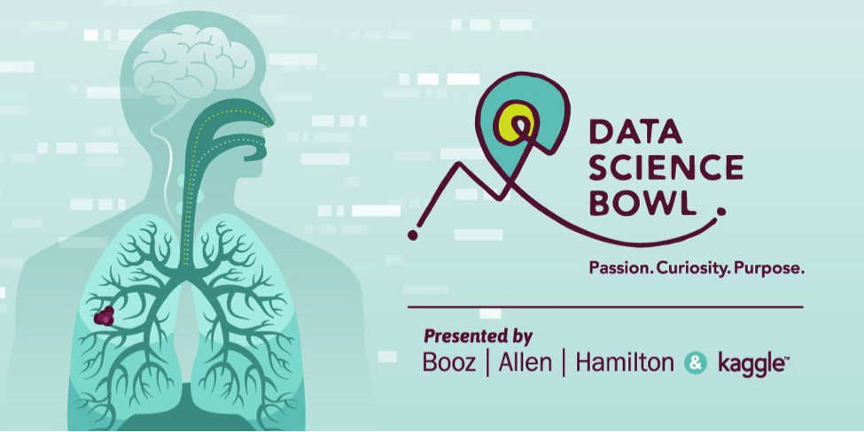
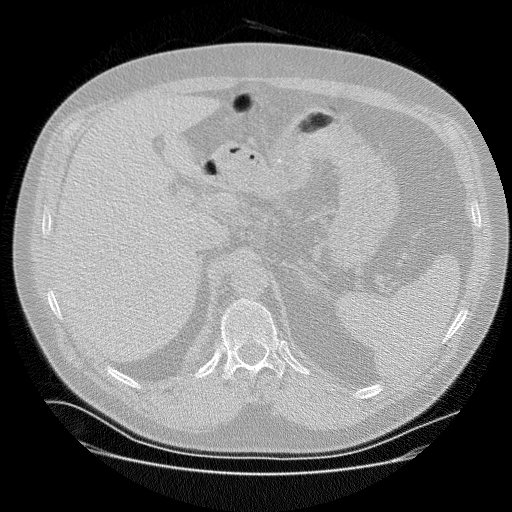
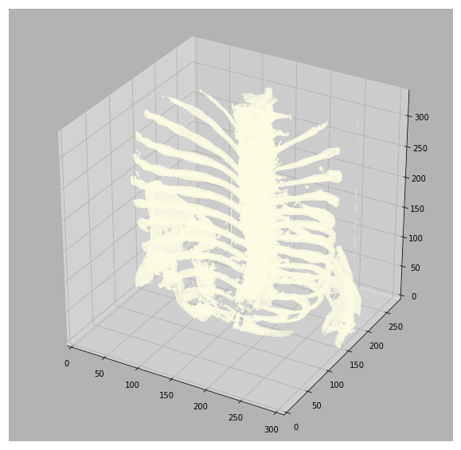
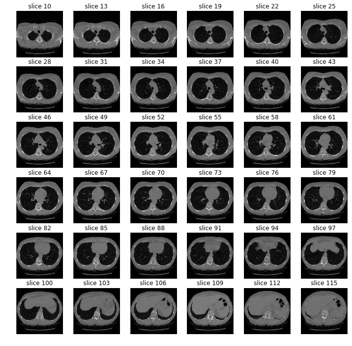
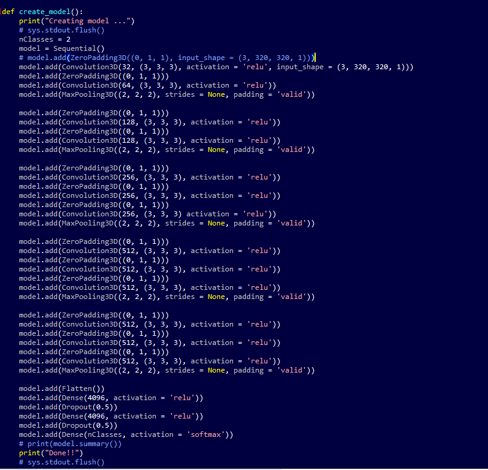
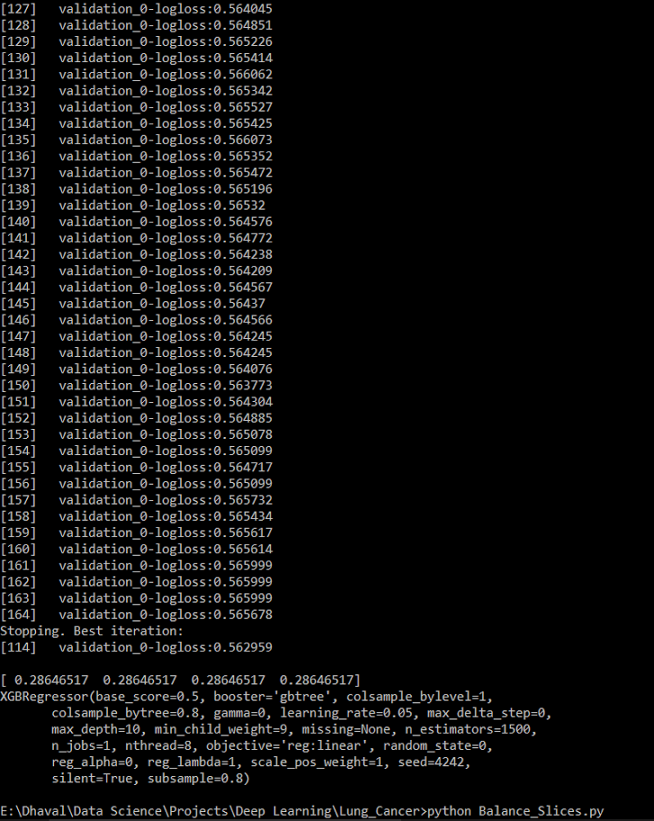

# Detecting Cancerous Lesions From the CT Scans Of Lungs Of Patients Using Convolution Neural Networks

### Data Science Bowl 2017

## The Problem
The United States accounts for the loss of approximately 225,000 people each year due to lung cancer, with an added monetary loss of $12 billion dollars each year. The office of the Vice President allots a special concentration of effort in the direction of early detection of lung cancer, since this can increase survival rate of the victims. In accordance with Kaggle & ‘Booz, Allen, Hamilton’, they host a competition on Kaggle for detecting malignant blobs and nodules in the CT scans of patients by devising powerful machine learning algorithm. Being an interesting problem, providing a wide range of approaches for devising a solution, we (the team) decided to work on the Data Science Bowl 2017 problem.

[Kaggle Data Science Bowl 2017](https://www.kaggle.com/c/data-science-bowl-2017)

## Data & Pre-processing
The competition organizers have provided 2 categories of data sets. The first category is a set of images of the CT scans
of different patients. The second aspect of the dataset involves a set of labels for the patients. The number of CT scan images
for every patient is not fixed & hence, the number of the images is different.

Since the data provided by the contributors are DICOM files of patients’ CT scans, it involves complicated pre-processing methods in order to get into the form that is usable to apply deep learning and machine learning methodologies to it.
An overview of the chronology of tasks involved in the preprocessing steps are as follows:
 1. Loading the DICOM files: Pixel information for each file and the respective metadata from each scan of each patient is extracted and is extremely useful.
 2. Adding missing metadata: Missing metadata of the 'z' axis is inferred.
 3. Converting the pixel values to Hounsfield Units (HU): Pixel units are converted to Hounsfeld Units, which represent the density of the matter shown in that position in the scan.
 4. 3D plotting: Since, CT scans are 3D images. Visualizing them in a 3D structure gives a better idea of what we are looking at.
 5. Lung Segmentation: Lung segmentation is a process to identify boundaries of lungs in a CT scan image. Lung Tissue, Blood in Heart, Muscles and other lean tissues are removed by thresholding the pixels, setting a particular color for air background and using dilation and erosion operations for better separation and clarity.
 6. Normalization: Normalization is a good approach in deep learning and particularly for this problem, since it involves Hounsfeld Units, the pixel values need to be normalized.
 7. Zero Centering: Zero Scaling is important to reduce the effect of the scaling differenced and depend only on the content of the images.
 
 
 
 
 
## Model Training:
We use a unique way to generate features from the data. CNNs used to create features from the images that have we have used for training and testing. The convolutional neural networks produce 2048 features. The CNN architecture looks as follows:

 
We then use these features as input to our XGBOOST model to predict if the CT scan of the particular patient is cancerous or not.

